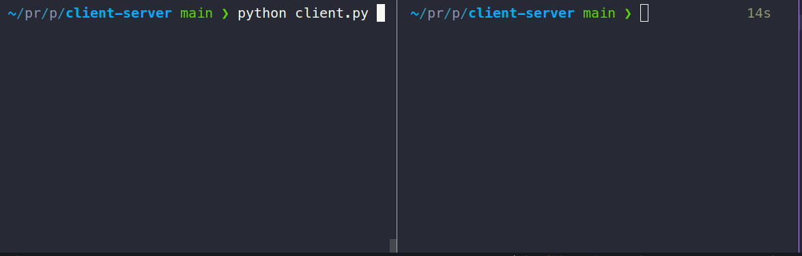

# CLI Chat



This is a simple client-server application built using Python and sockets. The application allows clients to connect to a server and exchange messages with each other.

## Requirements
- Python 3.7 or higher


## How to run
1. Clone the repository:
```bash
git clone https://github.com/alexSmkh/client-server.git
```
2. Navigate to the client-server directory:
```bash
cd client-server
```

3. Run the server:
```bash
python server.py
```

4. In a separate terminal, run the client:
```bash
python client.py
```

5. Choose a nickname for the client when prompted.

6. Exchange messages with other connected clients.

To gracefully exit the chat, type the exit command: `:q`.